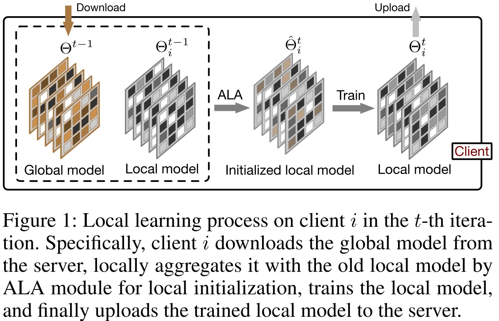
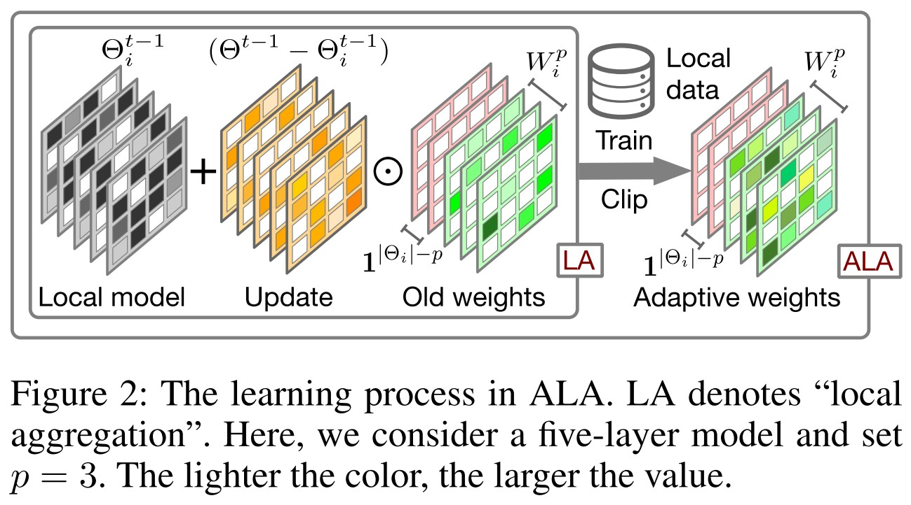
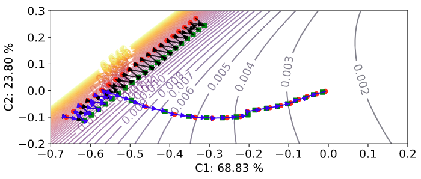

# Introduction

This is the implementation of our paper *[FedALA: Adaptive Local Aggregation for Personalized Federated Learning](https://arxiv.org/abs/2212.01197)* (accepted by AAAI 2023).


# Dataset

Here, we only upload the mnist dataset in the default heterogeneous setting with Dir(0.1) for example. You can generate other datasets following [PFL-Non-IID](https://github.com/TsingZ0/PFL-Non-IID).


# System

- `main.py`: configurations of **FedALA**. 
- `run_me.sh`: start **FedALA**. 
- `env_linux.yaml`: python environment to run **FedALA** on Linux. 
- `./flcore`: 
    - `./clients/clientALA.py`: the code on the client. 
    - `./servers/serverALA.py`: the code on the server. 
    - `./trainmodel/models.py`: the code for backbones. 
- `./utils`:
    - `ALA.py`: the code of our **Adaptive Local Aggregation (ALA)** module
    - `data_utils.py`: the code to read the dataset. 

# Adaptive Local Aggregation (ALA) module

`./system/utils/ALA.py` is the implementation of the ALA module, which corresponds to the pseudocode from `line 6` to `line 16` in Algorithm 1 in our paper. You can easily apply the ALA module to other federated learning (FL) methods by importing it as a Python module. 

## Details
- `adaptive_local_aggregation`: It prepares the work before weight learning, randomly selecting local training data and preserving the lower layers of the update. Since the parameters in the models will be changed during the ALA process, we use their references for convenience. Then, it learns the weight for local aggregation. Firstly, to prevent influencing the local model training, we clone the local model as the *temp local model*, only for obtaining the gradients after backpropagation of the local model during the weight learning. Then, we freeze the parameters of the lower layers of the *temp local model* to prevent gradients computation in Pytorch. We initialize the weight and *temp local model* before weight training. After that, we train the weight until convergence in the second iteration and train only one epoch in the subsequent iterations. Finally, we set the parameters of the *temp local model* to the corresponding parameters of the local model to obtain the initialized local model. 

## Illustrations

- Local learning process on client i in the t-th iteration. Specifically, client i downloads the global model from the server, locally aggregates it with the old local model by ALA module for local initialization, trains the local model, and finally uploads the trained local model to the server.



- The learning process in ALA. LA denotes "local aggregation". Here, we consider a five-layer model and set p=3. The lighter the color, the larger the value.



- Update direction correction. 2D visualization of local learning trajectory (from iteration 140 to 200) and the local loss surface on MNIST in the pathological heterogeneous setting. The green square dots and red circles represent the local model at the beginning and end of each iteration, respectively. The black and blue trajectories with the arrows represent FedAvg and FedALA, respectively. The local models are projected to the 2D plane using PCA. C1 and C2 are the two principal components generated by the PCA.



## How to use
- Step 1: Import the ALA module as a Python module.
```
import ALA
```

- Step 2: Then, feed the required parameters (please refer to `ALA.py` for more details) to initialize the `ALA` module.
```
class Client(object):
    def __init__(self, ...):
        # other code
        self.ALA = ALA(self.id, self.loss, self.train_data, self.batch_size, 
                    self.rand_percent, self.layer_idx, self.eta, self.device)
        # other code
```

- Step 3: Thirdly, feed the reveived global model and the old local model to `self.ALA.adaptive_local_aggregation()` for local initialization. 
```
class Client(object):
    def __init__(self, ...):
        # other code
        self.ALA = ALA(self.id, self.loss, self.train_data, self.batch_size, 
                    self.rand_percent, self.layer_idx, self.eta, self.device)
        # other code

    def local_initialization(self, received_global_model, ...):
        # other code
        self.ALA.adaptive_local_aggregation(received_global_model, self.model)
        # other code
```

# Simulation

## Environments
With the installed [conda](https://repo.anaconda.com/miniconda/Miniconda3-latest-Linux-x86_64.sh), we can run this platform in a conda virtual environment called *fl_torch*. 
```
conda env create -f env_linux.yaml # for Linux
```


## Training and Evaluation

All codes corresponding to **FedALA** are stored in `./system`. Just run the following commands.

```
cd ./system
sh run_me.sh
```
